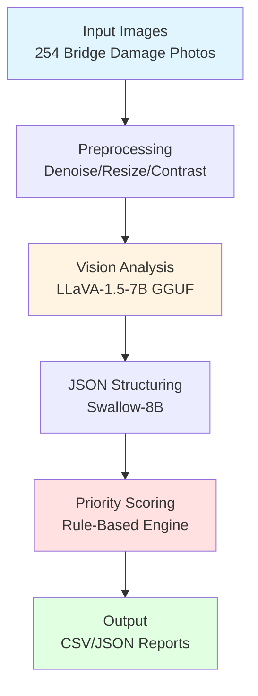

# Bridge Damage Assessment & Repair Priority Scoring System v0.1

**Automated Bridge Damage Analysis and Repair Prioritization using Vision-Language Models (LLaVA)**

[](https://www.python.org/)
[](https://pytorch.org/)
[](https://developer.nvidia.com/cuda-toolkit)
[](LICENSE)

> 🌏 [日本語版ドキュメント (Japanese Documentation)](README_JP.md)

## 📋 Table of Contents

- [Overview](#overview)
- [Pipeline Architecture](#pipeline-architecture)
- [v0.1 Achievements](#v01-achievements)
- [Performance Metrics](#performance-metrics)
- [Setup](#setup)
- [Usage](#usage)
- [Model Comparison](#model-comparison)
- [Tech Stack](#tech-stack)
- [Directory Structure](#directory-structure)
- [Troubleshooting](#troubleshooting)
- [Roadmap](#roadmap)

---

## Overview

An end-to-end pipeline for automated analysis of bridge structural damage (rebar exposure, cracks, corrosion) using **LLaVA (Large Language and Vision Assistant)**. The system generates expert-level damage descriptions from images and produces structured prioritization scores for repair planning.

### Key Features

- **Multi-Modal Vision Analysis**: Leverages LLaVA-1.5-7B for accurate damage assessment
- **Automated Structuring**: Converts natural language descriptions to structured JSON using Swallow-8B (Japanese LLM)
- **Intelligent Scoring**: Rule-based prioritization system (1-5 scale)
- **Production-Ready**: 100% success rate on 10-image test batch
- **GPU-Optimized**: Full GPU acceleration with quantized GGUF models (4GB)

---

## Pipeline Architecture

### High-Level Flow



### Detailed Pipeline Components

```mermaid
flowchart LR
    subgraph Input["📁 Input Stage"]
        A1[Raw Images<br/>PNG/JPG]
    end
  
    subgraph Preprocess["🔧 Preprocessing"]
        B1[Noise Reduction<br/>NL-Means]
        B2[Resize<br/>Max 1024x1024]
        B3[Contrast<br/>CLAHE]
    end
  
    subgraph Vision["👁️ Vision Analysis"]
        C1[Image Encoding<br/>CLIP Vision]
        C2[LLaVA Inference<br/>Q4_K_M Quantized]
        C3[Damage Description<br/>Japanese Text]
    end
  
    subgraph Structure["📊 Structuring"]
        D1[Swallow-8B LLM<br/>via Ollama]
        D2[JSON Parsing<br/>Multi-Pattern]
        D3[Structured Data<br/>Type/Severity/Location]
    end
  
    subgraph Score["🎯 Scoring"]
        E1[Rule Evaluation<br/>40% Severity<br/>35% Type<br/>15% Location<br/>10% Risk]
        E2[Priority Calculation<br/>0.0-1.0 Score]
        E3[Level Assignment<br/>1-5 Priority]
    end
  
    subgraph Output["💾 Output"]
        F1[CSV Export<br/>Batch Results]
        F2[JSON Export<br/>Detailed Records]
    end
  
    A1 --> B1 --> B2 --> B3
    B3 --> C1 --> C2 --> C3
    C3 --> D1 --> D2 --> D3
    D3 --> E1 --> E2 --> E3
    E3 --> F1
    E3 --> F2
  
    style Input fill:#e1f5ff
    style Vision fill:#fff4e1
    style Score fill:#ffe1e1
    style Output fill:#e1ffe1
```



### Component Details

| Stage | Module | Purpose | Technology |
|-------|--------|---------|------------|
| **Preprocessing** | `image_preprocessor.py` | Image quality enhancement | OpenCV 4.12 |
| **Vision Analysis** | `llama_cpp_vision.py` | Damage description generation | LLaVA-1.5-7B Q4_K_M (4GB) |
| **Structuring** | `json_structurer.py` | Natural language → JSON | Swallow-8B (Ollama) |
| **Scoring** | `priority_scorer.py` | Repair priority calculation | Rule-based (YAML) |
| **Pipeline** | `end_to_end.py` | Orchestration | Python 3.12 |

**Processing Time Breakdown** (per image):
```
┌─────────────────────────────────────────┐
│ Preprocessing:     ~2s  (4%)            │
│ Vision Analysis:  ~42s  (81%)           │
│ JSON Structuring:  ~5s  (10%)           │
│ Scoring:          <1s   (2%)            │
├─────────────────────────────────────────┤
│ Total: ~51.6 seconds/image              │
└─────────────────────────────────────────┘
```

---

## v0.1 Achievements

### ✅ Completed Features

- **3 Vision Modes Implemented**
  - **llama-cpp-python + GGUF** (Recommended): Lightweight, fast, full GPU utilization
  - HuggingFace Transformers: Stable, high accuracy
  - Ollama Integration: Easy setup (Note: CPU-only, slower)

- **Complete Pipeline**
  - Preprocessing module (OpenCV)
  - Vision analysis (LLaVA-1.5-7B)
  - JSON structuring (Swallow-8B via Ollama)
  - Priority scoring (Rule-based)

- **Validation Tests**
  - ✅ Single image: 42s/image
  - ✅ 10-image batch: 51.6s/image avg, 100% success rate
  - Priority distribution: Critical (Level 5) 60%, Moderate (Level 3) 40%

- **Windows Encoding Issues Resolved**
  - PowerShell cp932 support
  - llama.cpp C++ log suppression
  - UTF-8 encoding standardization

### 📊 Validation Data

- **Dataset**: 254 images of rebar exposure damage
- **GPU**: NVIDIA GeForce RTX 4060 Ti (16GB VRAM)
- **OS**: Windows 11
- **Environment**: Python 3.12.10 + CUDA 12.4

---

## Performance Metrics

### v0.1 Test Results

| Test Scale | Processing Time | Success Rate | Avg Time/Image |
|------------|-----------------|--------------|----------------|
| Single Image | 42s | 100% | 42s |
| 10-Image Batch | 8m 35s | 100% | 51.6s |
| 50-Image (Est.) | ~43m | - | ~52s |
| 254-Image (Est.) | ~3.6h | - | ~51s |

### Priority Distribution (10-Image Test)

- **Priority 5** (Immediate Repair Required): 6 images (60%)
- **Priority 3** (Planned Maintenance): 4 images (40%)

### Resource Utilization

- GPU Usage: 100% (all layers on GPU)
- VRAM: ~8GB / 16GB
- Model Size: 4.08GB (quantized GGUF)
- Processing Speed: ~51.6s/image

---

## Setup

### 1. System Requirements

- **OS**: Windows 10/11, Linux, or macOS
- **GPU**: NVIDIA GPU with 8GB+ VRAM (16GB recommended)
- **Python**: 3.10 or higher
- **CUDA**: 12.1 or higher
- **Storage**: 20GB+ free space

### 2. Clone Repository

```bash
git clone https://github.com/your-username/damage_text_score.git
cd damage_text_score
```

### 3. Create Virtual Environment

```bash
# Windows PowerShell
python -m venv .venv
.venv\Scripts\Activate.ps1

# Linux/macOS
python -m venv .venv
source .venv/bin/activate
```

### 4. Install Dependencies

```bash
# PyTorch (CUDA 12.4)
pip install torch torchvision torchaudio --index-url https://download.pytorch.org/whl/cu124

# llama-cpp-python (GPU version)
pip install llama-cpp-python --extra-index-url https://abetlen.github.io/llama-cpp-python/whl/cu124

# Other dependencies
pip install -r requirements.txt
```

### 5. Download Models

```bash
# LLaVA GGUF Model (Recommended)
python download_llava_gguf.py
# Downloads:
#   - models/ggml-model-q4_k.gguf (4.08GB)
#   - models/mmproj-model-f16.gguf (624MB)
```

### 6. Setup Ollama (for JSON Structuring)

```bash
# Install Ollama
# https://ollama.com/download

# Pull Swallow-8B model
ollama pull swallow8b-lora-n4000-v09-q4:latest
```

---

## Usage

### Quick Start

```bash
# Test single image (~42s)
python quickstart.py --mode 1

# Process 10-image batch (~8.5 min)
python quickstart.py --mode 2

# Process 50 images (~43 min)
python quickstart.py --mode 3

# Process all 254 images (~3.6 hours)
python quickstart.py --mode 4
```

### Output Files

```
data/outputs/
├── quickstart_single.csv        # Single image result
├── quickstart_10images.csv      # 10-image results
├── quickstart_50images.csv      # 50-image results
└── quickstart_254images.csv     # Full dataset results
```

### Output Format

**CSV Example:**

```csv
image_name,damage_type,severity,location,risk,priority_score,priority_level,description
kensg-rebarexposureRb_001.png,crack,high,girder,structural,0.952,5,Extensive cracking observed...
```

**JSON Structure:**

```json
{
  "damage_type": "rebar_exposure",
  "severity": "high",
  "location": "girder",
  "risk": "structural",
  "description_ja": "鉄筋露出が見られ、腐食が進行している...",
  "key_features": ["rebar exposure", "moderate corrosion"],
  "priority_score": 0.952,
  "priority_level": 5
}
```

### Custom Usage

```python
from src.pipeline.end_to_end import DamageAnalysisPipeline

# Initialize pipeline
pipeline = DamageAnalysisPipeline("config.yaml")

# Process single image
result = pipeline.process_image("path/to/image.png")

# Batch processing
results = pipeline.process_batch(image_paths, output_csv="results.csv")
```

---

## Model Comparison

### Vision Model Performance

| Mode | Model | Size | Time/Image | GPU Usage | Rating |
|------|-------|------|------------|-----------|--------|
| **llama-cpp-python** | LLaVA-1.5-7B Q4_K_M | 4.08GB | **51.6s** | 100% | ⭐⭐⭐⭐⭐ |
| HuggingFace | llava-1.5-7b-hf | 14GB | 45s | 100% | ⭐⭐⭐⭐ |
| Ollama | llava:7b | 4.7GB | 88s | 0% (CPU) | ⭐⭐ |

### Selection Criteria

- **llama-cpp-python** (Recommended)
  - ✅ Lightweight (4GB)
  - ✅ Full GPU utilization
  - ✅ Ollama-independent
  - ✅ Stable operation
  - ⚠️ Slight accuracy reduction due to quantization

- **HuggingFace**
  - ✅ Highest accuracy
  - ✅ Full GPU utilization
  - ⚠️ Large size (14GB)
  - ⚠️ High VRAM requirement

- **Ollama**
  - ⚠️ CPU-only operation (slow)
  - ⚠️ No GPU utilization
  - ✅ Easy setup

---

## Tech Stack

### Frameworks

- **PyTorch 2.6.0** - Deep learning framework
- **Transformers 4.57.6** - HuggingFace model hub
- **llama-cpp-python 0.3.16** - GGUF inference engine
- **OpenCV 4.12.0** - Image processing

### Models

- **LLaVA-1.5-7B** - Vision-Language Model
  - Paper: [Visual Instruction Tuning](https://arxiv.org/abs/2304.08485)
  - GGUF quantized version (Q4_K_M)
  
- **Swallow-8B** - Japanese LLM
  - Developer: TokyoTech LLM Project
  - Specialized for JSON structuring

### Libraries

- pandas 2.2.3 - Data manipulation
- pyyaml 6.0.2 - Configuration management
- tqdm 4.67.1 - Progress bars
- pillow 11.1.0 - Image processing

---

## Directory Structure

```
damage_text_score/
├── .venv/                          # Python virtual environment
├── data/                           # Dataset
│   ├── images_human_inspect_n254/  # Input images (254 files)
│   ├── preprocessed/               # Preprocessed images
│   └── outputs/                    # Processing results
│       ├── descriptions/           # Vision outputs
│       ├── structured/             # JSON structured outputs
│       └── scores/                 # Scoring results
├── models/                         # Model files
│   ├── ggml-model-q4_k.gguf        # LLaVA GGUF (4.08GB)
│   ├── mmproj-model-f16.gguf       # MMProj (624MB)
│   └── scoring_rules.yaml          # Scoring rules
├── src/                            # Source code
│   ├── preprocessing/              # Preprocessing module
│   │   └── image_preprocessor.py
│   ├── vision/                     # Vision analysis
│   │   ├── llama_cpp_vision.py     # llama-cpp-python (Recommended)
│   │   ├── granite_vision.py       # HuggingFace version
│   │   └── ollama_vision.py        # Ollama version
│   ├── structuring/                # JSON structuring
│   │   └── json_structurer.py
│   ├── scoring/                    # Scoring
│   │   └── priority_scorer.py
│   ├── pipeline/                   # Pipeline orchestration
│   │   └── end_to_end.py
│   └── utils/                      # Utilities
│       ├── config.py
│       └── ollama_client.py
├── config.yaml                     # System configuration
├── quickstart.py                   # Quick start script
├── download_llava_gguf.py          # Model download script
├── requirements.txt                # Python dependencies
├── README.md                       # This file (English)
├── README_JP.md                    # Japanese documentation
├── CHANGELOG.md                    # Version history
└── LICENSE                         # MIT License
```

---

## Troubleshooting

### Character Encoding Issues (Windows)

**Symptom**: Japanese characters appear garbled in PowerShell

**Solution**:
```powershell
# Change to UTF-8
chcp 65001
python quickstart.py
```

### CUDA Out of Memory

**Symptom**: `CUDA out of memory` error

**Solution**:
```yaml
# config.yaml
llama_cpp_vision:
  n_gpu_layers: 20  # Reduce from -1 (all layers) to partial GPU
```

### Ollama Connection Error

**Symptom**: `Failed to connect to Ollama`

**Solution**:
```bash
# Check Ollama server
ollama list

# Restart server
ollama serve
```

### llama-cpp-python Installation Error

**Symptom**: `Failed building wheel for llama-cpp-python`

**Solution**:
```bash
# Install CUDA version explicitly
pip install llama-cpp-python --extra-index-url https://abetlen.github.io/llama-cpp-python/whl/cu124

# Or enable CUDA via environment variable
$env:CMAKE_ARGS="-DLLAMA_CUBLAS=on"
pip install llama-cpp-python --force-reinstall --no-cache-dir
```

---

## Roadmap

### v0.2 Planned (2026 Q2)

- [ ] Execute and validate 50-image test
- [ ] Complete full 254-image processing
- [ ] Accuracy evaluation (comparison with human annotations)
- [ ] Batch processing optimization (parallelization)

### v1.0 Goals

- [ ] Web UI implementation (Streamlit/Gradio)
- [ ] REST API server
- [ ] Docker environment
- [ ] CI/CD pipeline
- [ ] Unit tests
- [ ] GAM model integration
- [ ] Real-time processing support

### Research Improvements

- [ ] Explore lighter vision models (LLaVA-1.6, MobileVLM)
- [ ] Few-shot learning for accuracy improvement
- [ ] Multi-modal learning (images + metadata)
- [ ] Active learning integration

---

## Citation

If you use this project in your research, please cite:

```bibtex
@software{bridge_damage_assessment_2026,
  title = {Bridge Damage Assessment and Repair Priority Scoring System},
  author = {Your Name},
  year = {2026},
  version = {0.1.0},
  url = {https://github.com/your-username/damage_text_score}
}
```

---

## References

1. Liu et al. (2023). "Visual Instruction Tuning" - LLaVA [[arXiv:2304.08485](https://arxiv.org/abs/2304.08485)]
2. TokyoTech LLM Project - Swallow Models [[GitHub](https://github.com/swallow-llm/swallow-llama)]
3. Georgi Gerganov - llama.cpp [[GitHub](https://github.com/ggerganov/llama.cpp)]

---

## License

MIT License - See [LICENSE](LICENSE) for details

---

## Contact

**Project Maintainer**: [Your Name]  
**Email**: [your.email@example.com]  
**GitHub**: [@your-username](https://github.com/your-username)

---

**Last Updated**: March 20, 2026 (v0.1.0)
