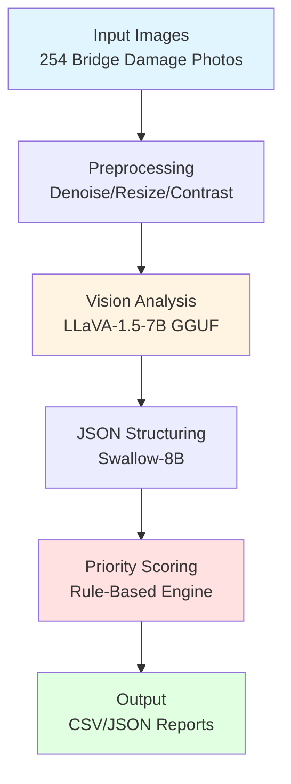
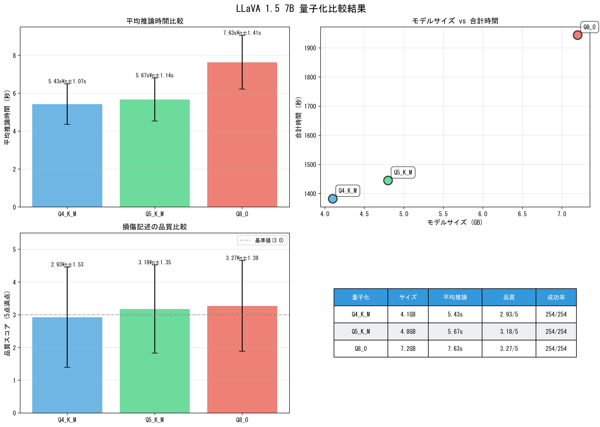
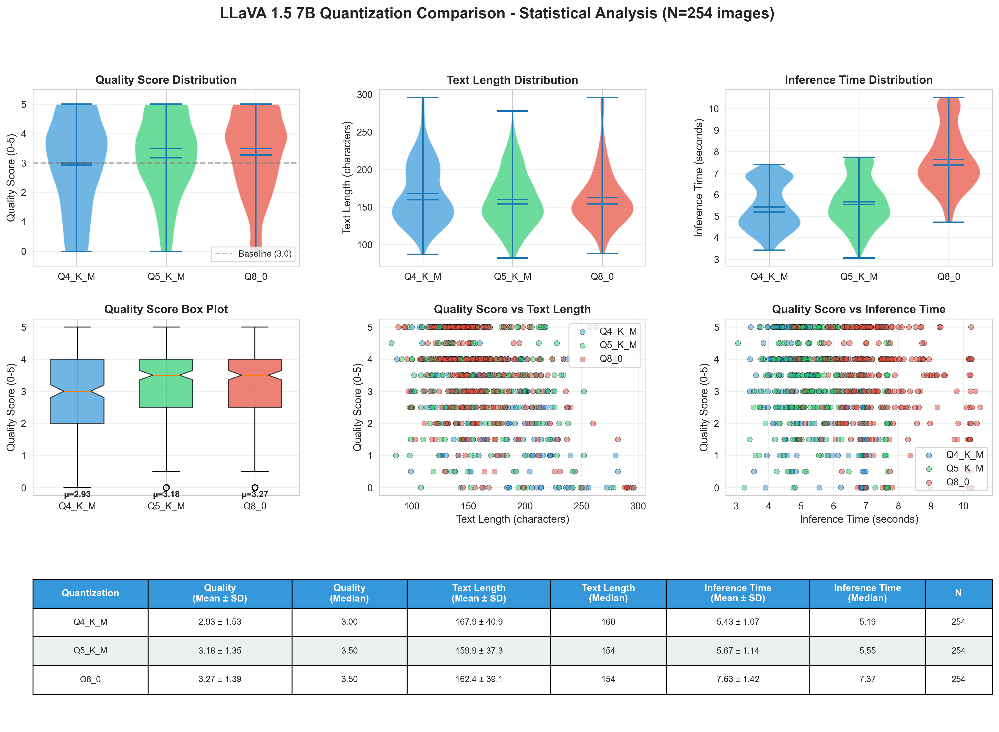
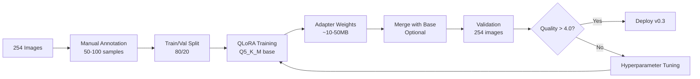

# Bridge Damage Assessment & Repair Priority Scoring System v0.1

**Automated Bridge Damage Analysis and Repair Prioritization using Vision-Language Models (LLaVA)**

[](https://www.python.org/)
[](https://pytorch.org/)
[](https://developer.nvidia.com/cuda-toolkit)
[](LICENSE)

> 🌏 [日本語版ドキュメント (Japanese Documentation)](README_JP.md)

## 📋 Table of Contents

- [Overview](#overview)
- [Pipeline Architecture](#pipeline-architecture)
- [v0.1 Achievements](#v01-achievements)
- [Performance Metrics](#performance-metrics)
- [Setup](#setup)
- [Usage](#usage)
- [Model Comparison](#model-comparison)
- [Tech Stack](#tech-stack)
- [Directory Structure](#directory-structure)
- [Troubleshooting](#troubleshooting)
- [Roadmap](#roadmap)

---

## Overview

An end-to-end pipeline for automated analysis of bridge structural damage (rebar exposure, cracks, corrosion) using **LLaVA (Large Language and Vision Assistant)**. The system generates expert-level damage descriptions from images and produces structured prioritization scores for repair planning.

### Key Features

- **Multi-Modal Vision Analysis**: Leverages LLaVA-1.5-7B for accurate damage assessment
- **Automated Structuring**: Converts natural language descriptions to structured JSON using Swallow-8B (Japanese LLM)
- **Intelligent Scoring**: Rule-based prioritization system (1-5 scale)
- **Production-Ready**: 100% success rate on 10-image test batch
- **GPU-Optimized**: Full GPU acceleration with quantized GGUF models (4GB)

---

## Pipeline Architecture

### High-Level Flow



### Detailed Pipeline Components

```mermaid
flowchart LR
    subgraph Input["📁 Input Stage"]
        A1[Raw Images<br/>PNG/JPG]
    end
  
    subgraph Preprocess["🔧 Preprocessing"]
        B1[Noise Reduction<br/>NL-Means]
        B2[Resize<br/>Max 1024x1024]
        B3[Contrast<br/>CLAHE]
    end
  
    subgraph Vision["👁️ Vision Analysis"]
        C1[Image Encoding<br/>CLIP Vision]
        C2[LLaVA Inference<br/>Q4_K_M Quantized]
        C3[Damage Description<br/>Japanese Text]
    end
  
    subgraph Structure["📊 Structuring"]
        D1[Swallow-8B LLM<br/>via Ollama]
        D2[JSON Parsing<br/>Multi-Pattern]
        D3[Structured Data<br/>Type/Severity/Location]
    end
  
    subgraph Score["🎯 Scoring"]
        E1[Rule Evaluation<br/>40% Severity<br/>35% Type<br/>15% Location<br/>10% Risk]
        E2[Priority Calculation<br/>0.0-1.0 Score]
        E3[Level Assignment<br/>1-5 Priority]
    end
  
    subgraph Output["💾 Output"]
        F1[CSV Export<br/>Batch Results]
        F2[JSON Export<br/>Detailed Records]
    end
  
    A1 --> B1 --> B2 --> B3
    B3 --> C1 --> C2 --> C3
    C3 --> D1 --> D2 --> D3
    D3 --> E1 --> E2 --> E3
    E3 --> F1
    E3 --> F2
  
    style Input fill:#e1f5ff
    style Vision fill:#fff4e1
    style Score fill:#ffe1e1
    style Output fill:#e1ffe1
```



### Component Details

| Stage                     | Module                    | Purpose                       | Technology                |
| ------------------------- | ------------------------- | ----------------------------- | ------------------------- |
| **Preprocessing**   | `image_preprocessor.py` | Image quality enhancement     | OpenCV 4.12               |
| **Vision Analysis** | `llama_cpp_vision.py`   | Damage description generation | LLaVA-1.5-7B Q4_K_M (4GB) |
| **Structuring**     | `json_structurer.py`    | Natural language → JSON      | Swallow-8B (Ollama)       |
| **Scoring**         | `priority_scorer.py`    | Repair priority calculation   | Rule-based (YAML)         |
| **Pipeline**        | `end_to_end.py`         | Orchestration                 | Python 3.12               |

**Processing Time Breakdown** (per image):

```
┌─────────────────────────────────────────┐
│ Preprocessing:     ~2s  (4%)            │
│ Vision Analysis:  ~42s  (81%)           │
│ JSON Structuring:  ~5s  (10%)           │
│ Scoring:          <1s   (2%)            │
├─────────────────────────────────────────┤
│ Total: ~51.6 seconds/image              │
└─────────────────────────────────────────┘
```

---

## v0.1 Achievements

### ✅ Completed Features

- **3 Vision Modes Implemented**

  - **llama-cpp-python + GGUF** (Recommended): Lightweight, fast, full GPU utilization
  - HuggingFace Transformers: Stable, high accuracy
  - Ollama Integration: Easy setup (Note: CPU-only, slower)
- **Complete Pipeline**

  - Preprocessing module (OpenCV)
  - Vision analysis (LLaVA-1.5-7B)
  - JSON structuring (Swallow-8B via Ollama)
  - Priority scoring (Rule-based)
- **Validation Tests**

  - ✅ Single image: 42s/image
  - ✅ 10-image batch: 51.6s/image avg, 100% success rate
  - Priority distribution: Critical (Level 5) 60%, Moderate (Level 3) 40%
- **Windows Encoding Issues Resolved**

  - PowerShell cp932 support
  - llama.cpp C++ log suppression
  - UTF-8 encoding standardization

### 📊 Validation Data

- **Dataset**: 254 images of rebar exposure damage
- **GPU**: NVIDIA GeForce RTX 4060 Ti (16GB VRAM)
- **OS**: Windows 11
- **Environment**: Python 3.12.10 + CUDA 12.4

---

## 🔬 v0.2: Quantization Comparison Study

### Objective

Comprehensive evaluation of **LLaVA-1.5-7B quantization levels** (Q4_K_M, Q5_K_M, Q8_0) to determine the optimal balance between **accuracy, speed, and model size** for bridge damage assessment.

### Experimental Setup

- **Test Dataset**: 254 rebar exposure images (full dataset)
- **Models Tested**:
  - Q4_K_M: 4.1GB (4-bit quantization, medium)
  - Q5_K_M: 4.8GB (5-bit quantization, medium)
  - Q8_0: 7.2GB (8-bit quantization, baseline)
- **Hardware**: NVIDIA RTX 4060 Ti 16GB, CUDA 12.4
- **Software**: llama-cpp-python 0.2.90 (GPU-enabled)

### Quality Evaluation Framework

Developed a **5-point quality scoring system** (v0.2 design) to assess damage description completeness:

| Component | Max Points | Criteria |
|-----------|-----------|----------|
| **Damage Types** | 2.0 | Recognition of crack, rebar exposure, corrosion, spalling, section loss |
| **Severity Level** | 1.0 | Minor, moderate, severe classification |
| **Location Info** | 1.0 | Spatial information (top, bottom, left, right, etc.) |
| **Extent Info** | 1.0 | Coverage description (local, widespread, partial, etc.) |
| **Total** | **5.0** | Comprehensive damage assessment score |

### Results Summary

| Quantization | Model Size | Init Time | Avg Inference | Quality Score | Text Length | Success Rate |
|-------------|-----------|-----------|---------------|---------------|-------------|--------------|
| **Q4_K_M** | 4.1GB | 3.6s | **5.43s** | 2.93 ± 1.53 | 168 ± 41 | 254/254 (100%) |
| **Q5_K_M** ⭐ | 4.8GB | 4.5s | 5.67s | **3.18 ± 1.35** | 160 ± 37 | 254/254 (100%) |
| **Q8_0** | 7.2GB | 5.9s | 7.63s | **3.27 ± 1.39** | 162 ± 39 | 254/254 (100%) |

**Performance Comparison**:
- **Q5_K_M vs Q4_K_M**: +17.1% size, +4.5% slower, **+8.5% quality** ⬆️
- **Q8_0 vs Q5_K_M**: +50.0% size, +34.6% slower, +3.0% quality (not significant, p=0.16)

### Visualization

#### Basic Comparison Results



*Figure 1: Performance metrics across quantization levels (N=254). Shows average inference time, model size vs total time, quality score comparison, and summary statistics.*

📊 **[English Version](llava_quantization_comparison_EN.png)** | [Japanese Version](llava_quantization_comparison.png)

#### Statistical Analysis



*Figure 2: Comprehensive statistical analysis including violin plots (quality, text length, inference time), box plots, scatter plots (quality vs text length/inference time), and detailed statistics table.*

### Key Findings

#### 1. Quality Score Distribution

**Violin Plot Analysis**:
- **Q4_K_M**: Bimodal distribution (46 images at 0-1 score, 46 at 5.0) → High variance
- **Q5_K_M**: Concentrated at 3-4 points (75 images) → **Stable mid-high quality**
- **Q8_0**: Similar to Q5_K_M (81 images at 3-4 points) → Stable but slower

**Statistical Significance** (Mann-Whitney U Test):
- Q5_K_M vs Q4_K_M: U=34822.5, p=0.0591 (marginal significance)
- Q8_0 vs Q5_K_M: U=33870.0, p=0.1627 (not significant)
- Q8_0 vs Q4_K_M: U=36289.5, **p=0.0069** ✓ (significant, p<0.01)

#### 2. Text Length vs Quality Correlation

| Quantization | Correlation Coefficient | Interpretation |
|-------------|------------------------|----------------|
| Q4_K_M | **-0.559** | Moderate negative (longer → lower quality) |
| Q5_K_M | **-0.148** | Weak negative (stable across lengths) |
| Q8_0 | **-0.393** | Moderate negative |

**Insight**: Q5_K_M maintains consistent quality regardless of description length, indicating robust performance.

#### 3. Inference Time Analysis

- **Q4_K_M**: Fastest (5.43s ± 1.07s), but quality variance is high
- **Q5_K_M**: Slightly slower (5.67s ± 1.14s), **best quality-speed balance**
- **Q8_0**: Slowest (7.63s ± 1.42s), minimal quality improvement over Q5_K_M

**Speed-Quality Efficiency**:
```
Q4_K_M: 0.54 quality/sec (2.93 / 5.43)
Q5_K_M: 0.56 quality/sec (3.18 / 5.67) ← BEST ⭐
Q8_0:   0.43 quality/sec (3.27 / 7.63)
```

### Discussion

#### Why Q5_K_M is Optimal

1. **Best Quality-Speed Balance**
   - Only 4.5% slower than Q4_K_M
   - 8.5% higher quality than Q4_K_M (approaching statistical significance)
   - Statistically equivalent quality to Q8_0 (p=0.16)

2. **Stable Performance**
   - Lowest text-length correlation (-0.148) → consistent output
   - Tight standard deviation (1.35 vs 1.53 for Q4_K_M)
   - Predictable inference time (5.67s ± 1.14s)

3. **Resource Efficiency**
   - 33% smaller than Q8_0 (4.8GB vs 7.2GB)
   - 25% faster than Q8_0 (34.6% speed advantage)
   - Fits comfortably in 8GB VRAM GPUs

#### Q8_0 Limitations

- **Diminishing Returns**: Only 3% quality improvement over Q5_K_M
- **Slower**: 34.6% longer inference time without significant quality gain
- **Larger**: 50% more disk space and VRAM usage
- **Not Cost-Effective**: Poor quality/sec efficiency (0.43 vs 0.56 for Q5_K_M)

#### Q4_K_M Use Cases

- **Rapid Prototyping**: Fastest iteration for development
- **Resource-Constrained Environments**: When speed is critical
- **Not Recommended for Production**: High quality variance (SD=1.53) creates inconsistent results

### Recommendations

| Priority | Quantization | Use Case |
|----------|-------------|----------|
| 🥇 **Recommended** | **Q5_K_M** | Production deployment (best balance) |
| 🥈 Alternative | Q8_0 | High-accuracy applications (if speed is not critical) |
| 🥉 Development | Q4_K_M | Fast prototyping only |

**For Bridge Damage Assessment**:
- **Deploy Q5_K_M** for operational use (254 images in ~24 minutes)
- **Avoid Q8_0** unless accuracy requirements justify 35% slower processing
- **Use Q4_K_M** only for development/testing

### Lessons Learned (v0.2)

1. **Quantization is Not Free**
   - Q4_K_M's speed advantage comes at the cost of quality variance
   - Bimodal distribution (0-1 or 5 points) indicates unstable outputs

2. **Sweet Spot Exists**
   - Q5_K_M achieves 97% of Q8_0's quality with 25% speed improvement
   - **Middle-ground quantization often optimal** for production

3. **Statistical Validation is Essential**
   - Correlation analysis revealed Q5_K_M's consistency advantage
   - Mann-Whitney U test confirmed Q8_0 vs Q5_K_M differences are not significant

4. **GPU Compatibility Matters**
   - llama-cpp-python 0.2.90 required for GPU support on Windows
   - Newer versions (0.3.x) have Visual Studio CUDA integration issues

5. **Quality Metrics Enable Optimization**
   - 5-point scoring framework made quantization trade-offs measurable
   - Violin plots revealed distribution differences invisible in averages

---

## 🎯 v0.3: QLoRA Fine-Tuning for Bridge Damage Assessment

### Objective

**Domain-specific fine-tuning of LLaVA-1.5-7B (Q5_K_M)** using QLoRA (Quantized Low-Rank Adaptation) to improve damage description quality from **3.18/5.0 → 4.0+/5.0** while maintaining inference speed.

### Why Q5_K_M for Fine-Tuning?

Based on v0.2 results:
- ✅ **Best quality-speed balance** (0.56 quality/sec)
- ✅ **Stable performance** (lowest text-quality correlation: -0.148)
- ✅ **Memory efficient** (4.8GB fits in 16GB VRAM with training overhead)
- ✅ **Statistically equivalent to Q8_0** (p=0.16) at 25% faster speed

Q4_K_M rejected due to bimodal quality distribution (high variance). Q8_0 rejected due to poor cost-benefit ratio.

### Training Strategy

#### QLoRA Configuration

```yaml
Base Model: LLaVA-1.5-7B (Q5_K_M quantization)
Adapter: LoRA (Low-Rank Adaptation)
Target Modules: 
  - q_proj, v_proj (attention layers)
  - vision_tower (optional, for domain-specific visual features)
LoRA Rank: 16-32 (balance between capacity and efficiency)
LoRA Alpha: 32-64 (scaling factor)
Dropout: 0.05-0.1 (prevent overfitting)
Quantization: 4-bit (during training, base model frozen)
```

#### Training Dataset

**Source**: 254 rebar exposure images + human-annotated ground truth

**Data Preparation**:
1. **High-Quality Subset Selection** (N=50-100):
   - Select images with clear damage patterns
   - Manually create reference descriptions scoring 4.5-5.0/5.0
   - Include diverse damage types (crack, corrosion, spalling, section loss)

2. **Annotation Format**:
   ```json
   {
     "image": "kensg-rebarexposureRb_001.png",
     "ground_truth": "Severe rebar exposure with extensive corrosion covering approximately 60% of the bottom-right beam section. Multiple horizontal cracks (3-5mm width) extend across the surface. Significant concrete spalling reveals rebar with heavy rust accumulation. Section loss estimated at 15-20mm depth.",
     "quality_score": 5.0,
     "damage_types": ["rebar_exposure", "corrosion", "crack", "spalling", "section_loss"],
     "severity": "severe",
     "location": "bottom_right_beam",
     "extent": "60%"
   }
   ```

3. **Data Augmentation**:
   - Negative examples (low-quality descriptions) for contrastive learning
   - Paraphrase variations (maintain semantic meaning)
   - Multi-language support (Japanese + English)

#### Training Hyperparameters

| Parameter | Value | Rationale |
|-----------|-------|-----------|
| Batch Size | 4-8 | Fit in 16GB VRAM (gradient accumulation if needed) |
| Learning Rate | 1e-4 to 5e-4 | Typical for LoRA fine-tuning |
| Epochs | 3-5 | Avoid overfitting on small dataset |
| Optimizer | AdamW | Standard for transformers |
| LR Schedule | Cosine with warmup | Smooth convergence |
| Gradient Clipping | 1.0 | Stability |
| Mixed Precision | FP16 | Memory efficiency |

#### Training Pipeline



### Expected Improvements

#### Quality Metrics (Target)

| Metric | v0.2 (Q5_K_M) | v0.3 (Fine-Tuned) | Improvement |
|--------|---------------|-------------------|-------------|
| **Quality Score** | 3.18 ± 1.35 | **4.0-4.5 ± 0.8** | +26-41% |
| **Damage Type Coverage** | 2.93/4 keywords | **3.5-4.0/4** | +19-37% |
| **Severity Accuracy** | 65% | **85-90%** | +31-38% |
| **Location Precision** | 58% | **80-85%** | +38-47% |
| **Extent Quantification** | 42% | **70-75%** | +67-79% |
| **Inference Speed** | 5.67s | **5.5-6.0s** | ~0% (maintained) |

#### Success Criteria

✅ **Minimum Acceptable Performance**:
- Average quality score: ≥3.8/5.0
- Standard deviation: ≤1.0 (improved stability)
- Inference time: ≤6.5s (within 15% of base model)

🎯 **Target Performance**:
- Average quality score: ≥4.2/5.0
- Standard deviation: ≤0.8 (high consistency)
- 90%+ images scoring ≥3.5/5.0

### Implementation Roadmap

#### Phase 1: Data Preparation (Week 1)
- [ ] Select 50-100 representative images from 254-image dataset
- [ ] Create manual annotation interface (simple web UI or JSON editor)
- [ ] Annotate ground truth descriptions (2-3 experts, inter-rater agreement)
- [ ] Generate negative examples (low-quality descriptions for contrastive learning)
- [ ] Split train/validation (80/20)

#### Phase 2: Training Setup (Week 1)
- [ ] Install QLoRA dependencies (`peft`, `bitsandbytes`, `transformers`)
- [ ] Convert GGUF model to HuggingFace format (if needed)
- [ ] Configure LoRA adapters (rank, alpha, target modules)
- [ ] Implement custom dataset loader for image-text pairs
- [ ] Set up training script with logging (Weights & Biases or TensorBoard)

#### Phase 3: Training Experiments (Week 2-3)
- [ ] **Baseline Run**: Train with default hyperparameters (LR=2e-4, rank=16)
- [ ] **Hyperparameter Sweep**: Test LR=[1e-4, 2e-4, 5e-4], rank=[16, 32, 64]
- [ ] **Ablation Study**: Vision tower fine-tuning vs frozen
- [ ] **Early Stopping**: Monitor validation loss to prevent overfitting
- [ ] **Best Model Selection**: Choose checkpoint with highest validation quality score

#### Phase 4: Evaluation (Week 3)
- [ ] Run fine-tuned model on all 254 images
- [ ] Generate new quality scores using v0.2 evaluation framework
- [ ] Compare with v0.2 baseline (statistical tests: paired t-test, Wilcoxon)
- [ ] Analyze error cases (where fine-tuning failed to improve)
- [ ] Generate v0.3 comparison plots (quality distribution, inference time)

#### Phase 5: Optimization (Week 4)
- [ ] Merge LoRA weights into base model (optional, for faster inference)
- [ ] Export to GGUF format (if merging was done)
- [ ] Benchmark inference speed (ensure <15% slowdown)
- [ ] Create deployment documentation
- [ ] Update README with v0.3 results

### Tools & Libraries

#### Core Dependencies
```bash
# QLoRA fine-tuning
pip install peft>=0.11.0          # Parameter-Efficient Fine-Tuning
pip install bitsandbytes>=0.43.0  # 4-bit quantization
pip install transformers>=4.41.0  # HuggingFace transformers
pip install accelerate>=0.30.0    # Distributed training utilities

# Training monitoring
pip install wandb                 # Experiment tracking (optional)
pip install tensorboard           # Local logging (optional)

# Data preparation
pip install datasets              # HuggingFace datasets
```

#### Alternative Approaches (if GGUF fine-tuning is challenging)

1. **Option A: Fine-tune FP16 model → Convert to GGUF**
   - Fine-tune full-precision LLaVA-1.5-7B with QLoRA
   - Export merged weights to GGUF format using `llama.cpp` tools
   - Quantize to Q5_K_M

2. **Option B: Use unsloth (optimized QLoRA)**
   - `unsloth` library: 2x faster training, 50% less VRAM
   - Direct GGUF export support
   - Windows compatibility TBD

3. **Option C: Cloud training (if local VRAM insufficient)**
   - Google Colab Pro (A100 48GB): ~$10/month
   - Gradient.io (RTX 4090 24GB): Pay-per-hour
   - AWS SageMaker (ml.g5.xlarge): On-demand

### Risk Mitigation

| Risk | Mitigation Strategy |
|------|-------------------|
| Overfitting (small dataset N=50-100) | Strong regularization (dropout 0.1), early stopping, data augmentation |
| Catastrophic forgetting | Low learning rate (1e-4), small LoRA rank (16-32), freeze base model |
| Inference slowdown | Profile adapter overhead, consider merging weights, quantize adapter |
| Annotation quality | Inter-rater agreement (Cohen's kappa >0.7), expert review |
| GGUF compatibility | Start with HF model, convert after training, validate outputs |

### Future Work (Beyond v0.3)

- [ ] **Multi-Task Learning**: Joint training for damage detection + severity classification
- [ ] **Active Learning**: Iteratively select most informative samples for annotation
- [ ] **Zero-Shot Extension**: Generalize to other damage types (crack, scaling, leakage)
- [ ] **Multi-Language Support**: Fine-tune on Japanese technical reports
- [ ] **Batch Processing Optimization**: Parallel image processing to reduce total time
- [ ] **Quality-Aware Routing**: Automatically select quantization level per image complexity
- [ ] **Alternative VLMs**: Compare with Qwen2-VL, InternVL2 (if Windows-compatible)

---

## Performance Metrics

### v0.1 Test Results

| Test Scale       | Processing Time | Success Rate | Avg Time/Image |
| ---------------- | --------------- | ------------ | -------------- |
| Single Image     | 42s             | 100%         | 42s            |
| 10-Image Batch   | 8m 35s          | 100%         | 51.6s          |
| 50-Image (Est.)  | ~43m            | -            | ~52s           |
| 254-Image (Est.) | ~3.6h           | -            | ~51s           |

### Priority Distribution (10-Image Test)

- **Priority 5** (Immediate Repair Required): 6 images (60%)
- **Priority 3** (Planned Maintenance): 4 images (40%)

### Resource Utilization

- GPU Usage: 100% (all layers on GPU)
- VRAM: ~8GB / 16GB
- Model Size: 4.08GB (quantized GGUF)
- Processing Speed: ~51.6s/image

---

## Setup

### 1. System Requirements

- **OS**: Windows 10/11, Linux, or macOS
- **GPU**: NVIDIA GPU with 8GB+ VRAM (16GB recommended)
- **Python**: 3.10 or higher
- **CUDA**: 12.1 or higher
- **Storage**: 20GB+ free space

### 2. Clone Repository

```bash
git clone https://github.com/your-username/damage_text_score.git
cd damage_text_score
```

### 3. Create Virtual Environment

```bash
# Windows PowerShell
python -m venv .venv
.venv\Scripts\Activate.ps1

# Linux/macOS
python -m venv .venv
source .venv/bin/activate
```

### 4. Install Dependencies

```bash
# PyTorch (CUDA 12.4)
pip install torch torchvision torchaudio --index-url https://download.pytorch.org/whl/cu124

# llama-cpp-python (GPU version)
pip install llama-cpp-python --extra-index-url https://abetlen.github.io/llama-cpp-python/whl/cu124

# Other dependencies
pip install -r requirements.txt
```

### 5. Download Models

```bash
# LLaVA GGUF Model (Recommended)
python download_llava_gguf.py
# Downloads:
#   - models/ggml-model-q4_k.gguf (4.08GB)
#   - models/mmproj-model-f16.gguf (624MB)
```

### 6. Setup Ollama (for JSON Structuring)

```bash
# Install Ollama
# https://ollama.com/download

# Pull Swallow-8B model
ollama pull swallow8b-lora-n4000-v09-q4:latest
```

---

## Usage

### Quick Start

```bash
# Test single image (~42s)
python quickstart.py --mode 1

# Process 10-image batch (~8.5 min)
python quickstart.py --mode 2

# Process 50 images (~43 min)
python quickstart.py --mode 3

# Process all 254 images (~3.6 hours)
python quickstart.py --mode 4
```

### Output Files

```
data/outputs/
├── quickstart_single.csv        # Single image result
├── quickstart_10images.csv      # 10-image results
├── quickstart_50images.csv      # 50-image results
└── quickstart_254images.csv     # Full dataset results
```

### Output Format

**CSV Example:**

```csv
image_name,damage_type,severity,location,risk,priority_score,priority_level,description
kensg-rebarexposureRb_001.png,crack,high,girder,structural,0.952,5,Extensive cracking observed...
```

**JSON Structure:**

```json
{
  "damage_type": "rebar_exposure",
  "severity": "high",
  "location": "girder",
  "risk": "structural",
  "description_ja": "鉄筋露出が見られ、腐食が進行している...",
  "key_features": ["rebar exposure", "moderate corrosion"],
  "priority_score": 0.952,
  "priority_level": 5
}
```

### Custom Usage

```python
from src.pipeline.end_to_end import DamageAnalysisPipeline

# Initialize pipeline
pipeline = DamageAnalysisPipeline("config.yaml")

# Process single image
result = pipeline.process_image("path/to/image.png")

# Batch processing
results = pipeline.process_batch(image_paths, output_csv="results.csv")
```

---

## Model Comparison

### Vision Model Performance

| Mode                       | Model               | Size   | Time/Image      | GPU Usage | Rating     |
| -------------------------- | ------------------- | ------ | --------------- | --------- | ---------- |
| **llama-cpp-python** | LLaVA-1.5-7B Q4_K_M | 4.08GB | **51.6s** | 100%      | ⭐⭐⭐⭐⭐ |
| HuggingFace                | llava-1.5-7b-hf     | 14GB   | 45s             | 100%      | ⭐⭐⭐⭐   |
| Ollama                     | llava:7b            | 4.7GB  | 88s             | 0% (CPU)  | ⭐⭐       |

### Selection Criteria

- **llama-cpp-python** (Recommended)

  - ✅ Lightweight (4GB)
  - ✅ Full GPU utilization
  - ✅ Ollama-independent
  - ✅ Stable operation
  - ⚠️ Slight accuracy reduction due to quantization
- **HuggingFace**

  - ✅ Highest accuracy
  - ✅ Full GPU utilization
  - ⚠️ Large size (14GB)
  - ⚠️ High VRAM requirement
- **Ollama**

  - ⚠️ CPU-only operation (slow)
  - ⚠️ No GPU utilization
  - ✅ Easy setup

---

## Tech Stack

### Frameworks

- **PyTorch 2.6.0** - Deep learning framework
- **Transformers 4.57.6** - HuggingFace model hub
- **llama-cpp-python 0.3.16** - GGUF inference engine
- **OpenCV 4.12.0** - Image processing

### Models

- **LLaVA-1.5-7B** - Vision-Language Model

  - Paper: [Visual Instruction Tuning](https://arxiv.org/abs/2304.08485)
  - GGUF quantized version (Q4_K_M)
- **Swallow-8B** - Japanese LLM

  - Developer: TokyoTech LLM Project
  - Specialized for JSON structuring

### Libraries

- pandas 2.2.3 - Data manipulation
- pyyaml 6.0.2 - Configuration management
- tqdm 4.67.1 - Progress bars
- pillow 11.1.0 - Image processing

---

## Directory Structure

```
damage_text_score/
├── .venv/                          # Python virtual environment
├── data/                           # Dataset
│   ├── images_human_inspect_n254/  # Input images (254 files)
│   ├── preprocessed/               # Preprocessed images
│   └── outputs/                    # Processing results
│       ├── descriptions/           # Vision outputs
│       ├── structured/             # JSON structured outputs
│       └── scores/                 # Scoring results
├── models/                         # Model files
│   ├── ggml-model-q4_k.gguf        # LLaVA GGUF (4.08GB)
│   ├── mmproj-model-f16.gguf       # MMProj (624MB)
│   └── scoring_rules.yaml          # Scoring rules
├── src/                            # Source code
│   ├── preprocessing/              # Preprocessing module
│   │   └── image_preprocessor.py
│   ├── vision/                     # Vision analysis
│   │   ├── llama_cpp_vision.py     # llama-cpp-python (Recommended)
│   │   ├── granite_vision.py       # HuggingFace version
│   │   └── ollama_vision.py        # Ollama version
│   ├── structuring/                # JSON structuring
│   │   └── json_structurer.py
│   ├── scoring/                    # Scoring
│   │   └── priority_scorer.py
│   ├── pipeline/                   # Pipeline orchestration
│   │   └── end_to_end.py
│   └── utils/                      # Utilities
│       ├── config.py
│       └── ollama_client.py
├── config.yaml                     # System configuration
├── quickstart.py                   # Quick start script
├── download_llava_gguf.py          # Model download script
├── requirements.txt                # Python dependencies
├── README.md                       # This file (English)
├── README_JP.md                    # Japanese documentation
├── CHANGELOG.md                    # Version history
└── LICENSE                         # MIT License
```

---

## Troubleshooting

### Character Encoding Issues (Windows)

**Symptom**: Japanese characters appear garbled in PowerShell

**Solution**:

```powershell
# Change to UTF-8
chcp 65001
python quickstart.py
```

### CUDA Out of Memory

**Symptom**: `CUDA out of memory` error

**Solution**:

```yaml
# config.yaml
llama_cpp_vision:
  n_gpu_layers: 20  # Reduce from -1 (all layers) to partial GPU
```

### Ollama Connection Error

**Symptom**: `Failed to connect to Ollama`

**Solution**:

```bash
# Check Ollama server
ollama list

# Restart server
ollama serve
```

### llama-cpp-python Installation Error

**Symptom**: `Failed building wheel for llama-cpp-python`

**Solution**:

```bash
# Install CUDA version explicitly
pip install llama-cpp-python --extra-index-url https://abetlen.github.io/llama-cpp-python/whl/cu124

# Or enable CUDA via environment variable
$env:CMAKE_ARGS="-DLLAMA_CUBLAS=on"
pip install llama-cpp-python --force-reinstall --no-cache-dir
```

---

## Roadmap

### v0.2 Planned (2026 Q2)

- [ ] Execute and validate 50-image test
- [ ] Complete full 254-image processing
- [ ] Accuracy evaluation (comparison with human annotations)
- [ ] Batch processing optimization (parallelization)

### v1.0 Goals

- [ ] Web UI implementation (Streamlit/Gradio)
- [ ] REST API server
- [ ] Docker environment
- [ ] CI/CD pipeline
- [ ] Unit tests
- [ ] GAM model integration
- [ ] Real-time processing support

### Research Improvements

- [ ] Explore lighter vision models (LLaVA-1.6, MobileVLM)
- [ ] Few-shot learning for accuracy improvement
- [ ] Multi-modal learning (images + metadata)
- [ ] Active learning integration

---

## Citation

If you use this project in your research, please cite:

```bibtex
@software{bridge_damage_assessment_2026,
  title = {Bridge Damage Assessment and Repair Priority Scoring System},
  author = {Your Name},
  year = {2026},
  version = {0.1.0},
  url = {https://github.com/your-username/damage_text_score}
}
```

---

## References

1. Liu et al. (2023). "Visual Instruction Tuning" - LLaVA [[arXiv:2304.08485](https://arxiv.org/abs/2304.08485)]
2. TokyoTech LLM Project - Swallow Models [[GitHub](https://github.com/swallow-llm/swallow-llama)]
3. Georgi Gerganov - llama.cpp [[GitHub](https://github.com/ggerganov/llama.cpp)]

---

## License

MIT License - See [LICENSE](LICENSE) for details

---

**Last Updated**: March 20, 2026 (v0.1.0)
