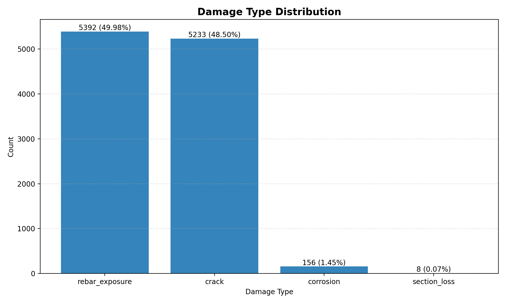
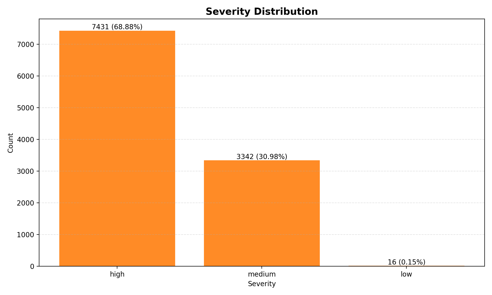
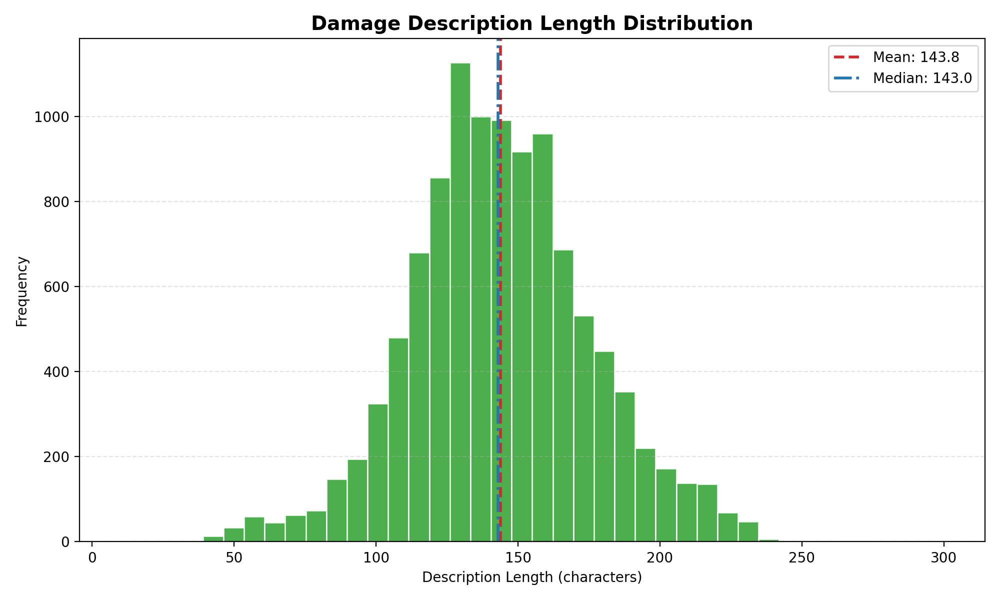
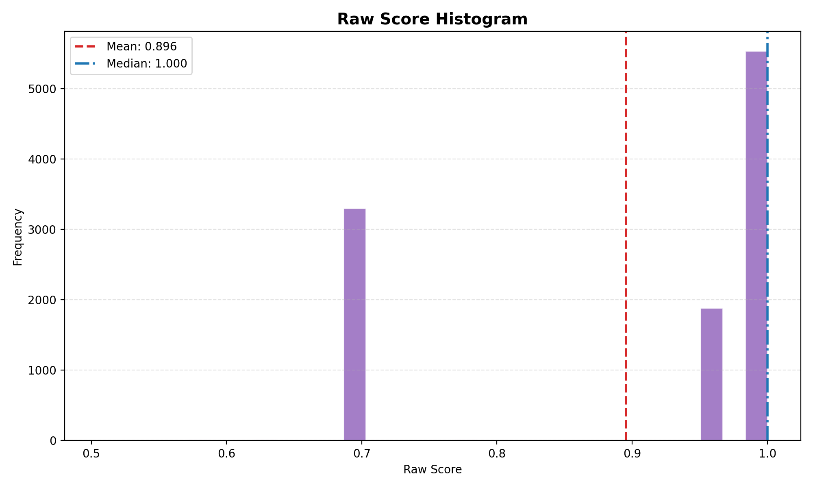

# Results: Inference n=10789

## Source
- Merged inference CSV: I:/ACT2025.5.26-2030/MVP/damage_text_score/data/outputs/inference_n10789_merged_final_20260331_225028.csv
- Total records: 10789

## 1. Damage Type Distribution

- rebar_exposure: 5392 (49.98%)
- crack: 5233 (48.50%)
- corrosion: 156 (1.45%)
- section_loss: 8 (0.07%)

## 2. Severity Distribution

- high: 7431 (68.88%)
- medium: 3342 (30.98%)
- low: 16 (0.15%)

## 3. Damage Description Length

- Count: 10789
- Mean length: 143.81 chars
- Median length: 143.00 chars
- Std: 31.86
- 90th percentile: 185.00 chars
- Min: 10 chars
- Max: 300 chars

## 4. Raw Score Histogram

- Count: 10789
- Mean score: 0.8955
- Median score: 1.0000
- Std: 0.1385
- 90th percentile: 1.0000
- Min: 0.5050
- Max: 1.0000

## Notes
- This report summarizes base-model inference outputs after merged deduplication.
- Description length is computed from the `損傷説明` column.
